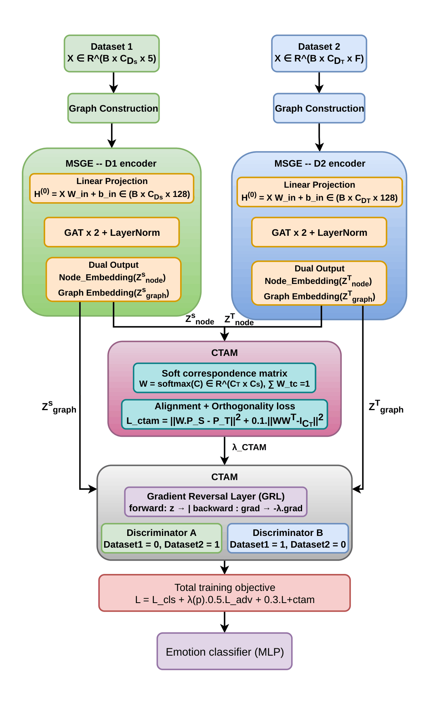
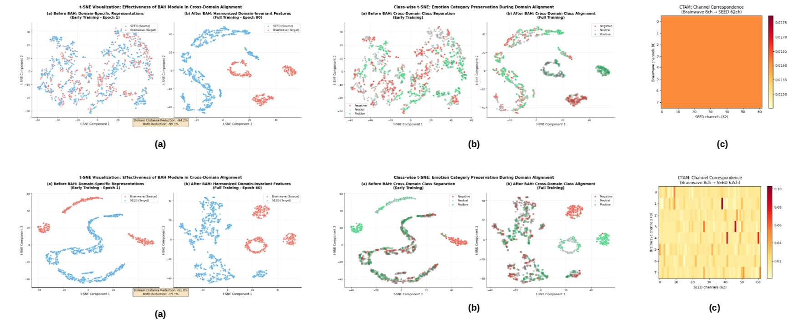

# 🧠 DG-BDH: Domain-Generalized Bidirectional Harmonization Framework for Cross-Domain Physiological Emotion Recognition

[](https://iconip2026.apnns.org/)

📄 **Accepted at ICONIP 2026 (International Conference on Neural Information Processing)**

---

## 📝 Overview

This repository contains the **official PyTorch implementation** of our paper:

**DG-BDH: A Domain-Generalized Bidirectional Harmonization Framework for Cross-Domain Physiological Emotion Recognition**

We propose **DG-BDH**, a **graph-based domain-harmonization framework** for **cross-dataset, cross-domain emotion recognition** from physiological signals (EEG and ECG/peripheral sensors).

Unlike conventional cross-domain emotion recognition methods that rely on single-direction adversarial adaptation or assume fixed sensor-space correspondence, DG-BDH introduces a novel **Cross-Modal Topology Alignment Module (CTAM)** that learns a soft correspondence between heterogeneous channel/sensor spaces, paired with a **Bidirectional Adversarial Harmonization (BAH)** mechanism that symmetrically aligns source and target embeddings.

Furthermore, a **dynamic functional-connectivity graph construction** strategy and an **orthogonality-constrained feature disentanglement** objective enable the framework to model inter-channel physiological relationships and preserve discriminative representations across heterogeneous EEG/ECG datasets and sensing modalities.

Despite the added structural and adversarial complexity, DG-BDH achieves **state-of-the-art cross-domain accuracy of 94.20%, 79.20%, and 93.62%** on the SEED, Brainwave, and WESAD benchmarks respectively — including the particularly challenging **EEG-to-peripheral (WESAD) transfer** setting.

---

## 🚀 Key Contributions

- Novel **Cross-Modal Topology Alignment Module (CTAM)** for soft channel/sensor correspondence across heterogeneous domains
- **Bidirectional Adversarial Harmonization (BAH)** with dual discriminators for symmetric domain-invariant alignment
- **Dynamic functional-connectivity graph construction** via per-batch Pearson-correlation adjacency
- **Orthogonality-constrained feature disentanglement** for discriminative, non-degenerate correspondence learning
- Annealed **Gradient Reversal Layer (GRL)** scheduling for stable adversarial optimization
- Consistent state-of-the-art performance across **EEG↔EEG** (SEED↔Brainwave) and **EEG↔peripheral** (↔WESAD) cross-domain settings

---

## 🏗️ Model Architecture

<p align="center">
  
</p>

The proposed architecture consists of:

- Functional connectivity graph construction (per-sample, per-batch Pearson correlation)
- Modality-Specific Graph Encoders (MSGE) with stacked Graph Attention (GAT) layers
- Cross-Modal Topology Alignment Module (CTAM) for shared-space channel correspondence
- Bidirectional Adversarial Harmonization (BAH) with dual domain discriminators
- Annealed Gradient Reversal Layer (GRL) scheduling
- Shared MLP emotion classifier over harmonized graph embeddings

---

## 🧠 Core Modules

DG-BDH bridges heterogeneous physiological sensing domains through four complementary components:

### 🔹 Functional Connectivity Graph Construction
- Builds a per-sample binary adjacency matrix via thresholded Pearson correlation
- Recomputed at every forward pass to reflect dynamic, sample-specific inter-channel dependencies
- Applies uniformly across EEG electrodes and peripheral (ECG/EDA/EMG/etc.) sensor channels

### 🔹 Modality-Specific Graph Encoders (MSGE)
- Independent GAT-based encoders per domain, sharing architecture but not parameters
- Produces both node-level embeddings (for CTAM) and pooled graph-level embeddings (for BAH/classification)

### 🔹 Cross-Modal Topology Alignment Module (CTAM)
- Learns a soft, row-normalized correspondence matrix between target and source channels
- Trained with an alignment (MSE) loss plus an orthogonality regularizer to avoid degenerate mappings
- Representational rather than anatomical — does not assume physiological equivalence between EEG and peripheral sensors

### 🔹 Bidirectional Adversarial Harmonization (BAH)
- Two complementary discriminators with reversed labels enforce symmetric, neutral domain alignment
- Combined with an annealed Gradient Reversal Layer (GRL) schedule for stable training

---

## 📂 Datasets

The proposed framework is evaluated on three physiological emotion-recognition benchmarks:

### 🧠 SEED
- 62-channel EEG, 15 subjects, 3 sessions each
- Three emotion classes: Positive, Negative, Neutral

### 🧠 Brainwave
- Multichannel EEG (raw + Delta/Theta/Alpha/Beta/Gamma band features)
- Three emotion classes: Positive, Negative, Neutral

### 🩺 WESAD
- Multimodal wearable physiological signals (ECG, EDA, EMG, respiration, temperature, BVP, acceleration)
- Three affective classes: Neutral, Stress, Amusement
- Demanding **EEG-to-peripheral** cross-domain transfer target

---

## 📈 Performance

### Trained on SEED

| Test Domain | Accuracy | Macro F1 |
|---|---|---|
| Brainwave | **94.20%** | **93.08%** |
| WESAD | **78.80%** | **77.15%** |

### Trained on Brainwave

| Test Domain | Accuracy | Macro F1 |
|---|---|---|
| SEED | **74.68%** | **72.78%** |
| WESAD | **79.20%** | **77.64%** |

### Trained on WESAD

| Test Domain | Accuracy | Macro F1 |
|---|---|---|
| Brainwave | **93.62%** | **91.73%** |
| SEED | **75.22%** | **73.86%** |

---

## 📊 Comparison with State-of-the-Art

All models trained on SEED, evaluated on unseen target datasets (Accuracy, %):

| Method | Brainwave | WESAD |
|---|---|---|
| EmotionCLIP | 77.82 | 68.85 |
| CATE | 75.56 | 64.80 |
| DFF-Net | 82.65 | 73.46 |
| DMMR | 80.38 | 64.57 |
| CPDAN | 79.82 | 70.73 |
| Dynamic Domain Adaptation | 76.78 | 67.58 |
| CLISA | 84.32 | 70.96 |
| **DG-BDH (Ours)** | **94.20** | **78.80** |

---

## 📊 Qualitative Results

<p align="center">
  
</p>

DG-BDH produces well-separated, domain-harmonized embedding clusters (t-SNE) and coherent channel-correspondence maps, demonstrating effective alignment across both EEG↔EEG and EEG↔peripheral cross-domain settings.

---

## 🔬 Ablation Study

We perform extensive ablation experiments (mean ± SD over 10 runs) to validate each component.

The study demonstrates the importance of:

- ✅ Cross-Modal Topology Alignment Module (CTAM)
- ✅ Bidirectional Adversarial Harmonization (BAH) over one-way (DANN-style) adaptation
- ✅ Annealed GRL scheduling over a fixed adaptation coefficient
- ✅ Orthogonality regularization for non-degenerate correspondence learning
- ✅ Dynamic correlation-based graph construction over identity/no-graph and flat-MLP baselines

Removing any single component causes substantial accuracy degradation, with the flat-MLP (no graph) variant performing worst across all cross-domain settings.

---

## ⚙️ Experimental Setup

- Framework: **PyTorch**
- GPU: **NVIDIA Tesla T4**
- Optimizer: **Adam** (weight decay 1×10⁻⁴)
- LR Schedule: **Cosine annealing**, 1×10⁻³ → 1×10⁻⁵
- Epochs: **80**
- Batch Size: **64**
- GAT Layers: **2**, Attention Heads: **4**
- Hidden Dimension: **128**, Latent Dimension: **64**
- Dropout: **0.3**
- Gradient Clipping: **max ℓ2 norm 1.0**
- Mixed-precision training

---

## 📌 Features

- Cross-Dataset & Cross-Domain Emotion Recognition
- Graph Attention-based Physiological Encoding
- Soft Cross-Modal Channel/Sensor Correspondence (CTAM)
- Bidirectional Adversarial Domain Harmonization (BAH)
- Dynamic Functional Connectivity Graphs
- Orthogonality-Constrained Feature Disentanglement
- EEG↔EEG and EEG↔Peripheral (WESAD) Transfer
- End-to-End Training

---

## ✍️ Authors

- **Saptarshi Pani**\* – Jadavpur University, India
- **Rajdeep Pal**\* – St. Thomas' College of Engineering and Technology, India
- **Viacheslav Gulvanskii** – Saint Petersburg Electrotechnical University "LETI", Russia
- **Dmitrii Kaplun**† – Saint Petersburg Electrotechnical University "LETI", Russia & China University of Mining and Technology, China
- **Ram Sarkar** – Jadavpur University, India

\* Authors contributed equally to this work
† Corresponding author

---

## ⚠️ Disclaimer

This repository is released **for academic research purposes only**.

- This model is **not intended for clinical diagnosis or affective-state monitoring in real-world/medical settings**.
- Performance is evaluated on publicly available benchmark datasets.
- Real-world deployment requires extensive validation across additional subjects, devices, and acquisition conditions.

---

## 📄 Paper

**DG-BDH: A Domain-Generalized Bidirectional Harmonization Framework for Cross-Domain Physiological Emotion Recognition**

📍 Accepted at **ICONIP 2026 (International Conference on Neural Information Processing)**

---

## ⭐ Citation

```bibtex

```
---

## 📬 Contact


**Saptarshi Pani** -- 📧 pani.saptarshi@gmail.com
**Rajdeep Pal** -- 📧 rajdeeppal167@gmail.com
